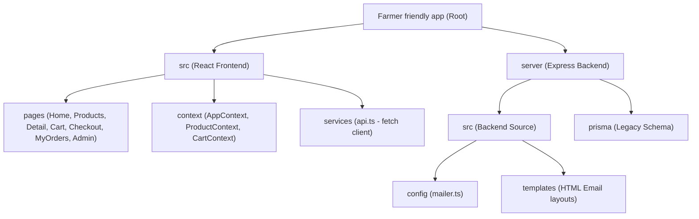

# KisanMart Marketplace — Complete Project Architecture & Summary

KisanMart is a premium, feature-rich, full-stack agricultural marketplace designed to connect buyers directly with local farmers across India. Originally structured with a MySQL-Prisma backend, the application has been successfully migrated to a high-performance **Firebase Realtime Database** with a Node.js + Express backend and a React + TypeScript frontend.

---

## 🛠️ Technology Stack

| Component | Technology | Description |
| :--- | :--- | :--- |
| **Frontend Core** | React 19, TypeScript, Vite | Fast, state-of-the-art SPA with Hot Module Replacement (HMR). |
| **Styling & Icons** | Vanilla CSS, Tailwind v4.0, Lucide | Premium, fully responsive design with sleek animations and high visual polish. |
| **Backend Core** | Node.js, Express, TypeScript | REST API endpoints for user syncing, orders, catalog CRUD, and admin stats. |
| **Database** | Firebase Realtime Database | Real-time document storage for users, products, categories, and orders. |
| **Email Service** | Nodemailer | Transactional email notifications (Order placement, processing, shipping, delivery, cancellation) with SMTP/Ethereal fallback. |
| **Auth & Security** | JSON Web Tokens (JWT) | Secure token-based authorization for administrative access. |

---

## 📂 Project Directory Structure



### 1. Frontend Architecture (`/src`)
*   **`pages/`**:
    *   `Home.tsx`: Premium hero section with custom animations, categories filter grid, and featured products showcase.
    *   `Products.tsx`: Advanced products filter bar (category, search, sorting by price/newest) with sidebar.
    *   `ProductDetail.tsx`: Fully-detailed view of a single product with farmer bio and location.
    *   `Cart.tsx` & `Checkout.tsx`: Seamless multi-step cart, address manager, and mock payment options.
    *   `Admin.tsx` & `AdminProducts.tsx` / `AdminOrders.tsx`: Highly-secure dashboard featuring catalog CRUD tools, revenue charts, and transaction statuses.
*   **`context/`**:
    *   `ProductContext.tsx`: Tracks product catalog state, fetching from the active Express/Firebase API with a seamless local seed fallback.
    *   `CartContext.tsx`: Tracks buyer items, quantity adjustments, and persists session cart items to `localStorage`.
    *   `AppContext.tsx`: Handles user authentication details, guest user state, and administrative JWT sessions.

### 2. Backend Architecture (`/server`)
*   **`server/src/index.ts`**: The main API server. Hosts secure routes for sync, stats, catalog updates, status toggles, and Nodemailer integration.
*   **`server/src/firebase.ts`**: Handles credentials checking (Local JSON file, environment strings, or default account) and initializes standard `firebase-admin` Database connections.
*   **`server/src/seedFirebase.ts`**: Scans the client `public/` directory categories & assets dynamically, seeding the Firebase database with realistic stocks, prices, images, and farmer locations.
*   **`server/src/config/mailer.ts`**: Configures Gmail SMTP for production and generates Ethereal test accounts in development to provide live browser previews of transactional emails.

---

## ✨ Key Features & Workflows

### 🌾 1. Buyer & Farmer Marketplace
*   **Visual Excellence**: Built with harmonious curated color palettes, elegant glassmorphism, responsive flex layouts, and custom loading animations.
*   **Catalog Syncing**: Product data is loaded dynamically from Firebase with standard offline fallbacks to local data seeds.
*   **Direct Sourcing**: Products specify individual farmer names, profiles, and locations (e.g., *Ramu Kaka, Nashik*), fostering trust.

### 💳 2. Payment & Checkout System
*   **Dual-Step Checkout Wizard**:
    1.  *Address*: Form with live validation for name, phone, email, and detailed address.
    2.  *Payment*: Toggle between **Cash on Delivery (COD)** and **UPI/PhonePe Scan**.
*   **Integrated UPI Flow**: Generates a local mock PhonePe QR code (`public/phonepe-qr.png`) for instant simulated payments.

### 🔒 3. Fully Functional Admin Panel
*   **Dashboard Analytics**: Visual counters displaying Total Products, Total Orders, Delivered Revenue, and Pending Orders with action notices.
*   **Drawer CRUD Controls**: An elegant slide-over drawer to add or edit products in real time with quick schema mapping (Stock, Unit, Description, Farmer Details, Image URL).
*   **Order State Machine**: Admins can change order statuses (`Pending` ➔ `Processing` ➔ `Shipped` ➔ `Delivered` ➔ `Cancelled`) from a dropdown, automatically updating stock levels and sending transaction emails to the buyer.

---

## ✉️ Transactional Email Preview Engine

A highly polished feature of the server is its **automated transaction email template engine** (`server/src/templates/emails.ts`). When an order is placed or updated, the system sends highly styled HTML emails:

```
[Buyer Places Order] ➔ Confirmation Email
[Admin Sets "Processing"] ➔ Processing Update Email
[Admin Sets "Shipped"] ➔ Shipping tracking Email
[Admin Sets "Delivered"] ➔ Delivery Receipt Email
[Admin Sets "Cancelled"] ➔ Cancellation Notice Email
```

> [!TIP]
> When using Ethereal test credentials, the server returns a dynamic `previewUrl`. The admin interface shows a **"View Live Email Preview"** link, allowing developers to inspect actual HTML emails in real time inside their web browser!

---

## 🔧 Recent Improvements & Fixes

1.  **Firebase ESM vs CommonJS Fix (`server/src/firebase.ts`)**:
    *   *Issue*: Node threw a `ReferenceError: exports is not defined` because the tsconfig used `"module": "commonjs"` while parent directories specified `"type": "module"`. The use of `createRequire` and `import.meta.url` triggered incorrect ESM module resolution.
    *   *Fix*: Refactored to standard `path.join(__dirname, ...)` and `fs.readFileSync` for JSON loading. This made the file 100% compliant with standard CommonJS module loaders and fixed the server crash.
2.  **Dynamic Frontend Database Sync (`src/context/ProductContext.tsx`)**:
    *   *Improvement*: Updated `ProductProvider` to fetch products dynamically from the Express Firebase API (`http://localhost:5000/api/products`) when online, falling back to local JS seeds when the server is offline. This enables real-time product updates on the marketplace.

---

## 🚀 Running & Authenticating the Project

### Starting the Applications
1.  **Backend Server**:
    ```powershell
    cd "e:\Farmer friendly app\server"
    npm run dev
    # Server will start on http://localhost:5000/
    ```
2.  **Vite Frontend SPA**:
    ```powershell
    cd "e:\Farmer friendly app"
    npm run dev
    # Client will start on http://localhost:5173/
    ```

### Admin Authentication Details
*   **Route**: Navigate to `http://localhost:5173/admin`
*   **Security PIN / Password**: `Gopi@7842239728`
*   **Backend JWT Auth API**:
    *   *User*: `admin@kisanmart.com`
    *   *Password*: `admin123`
